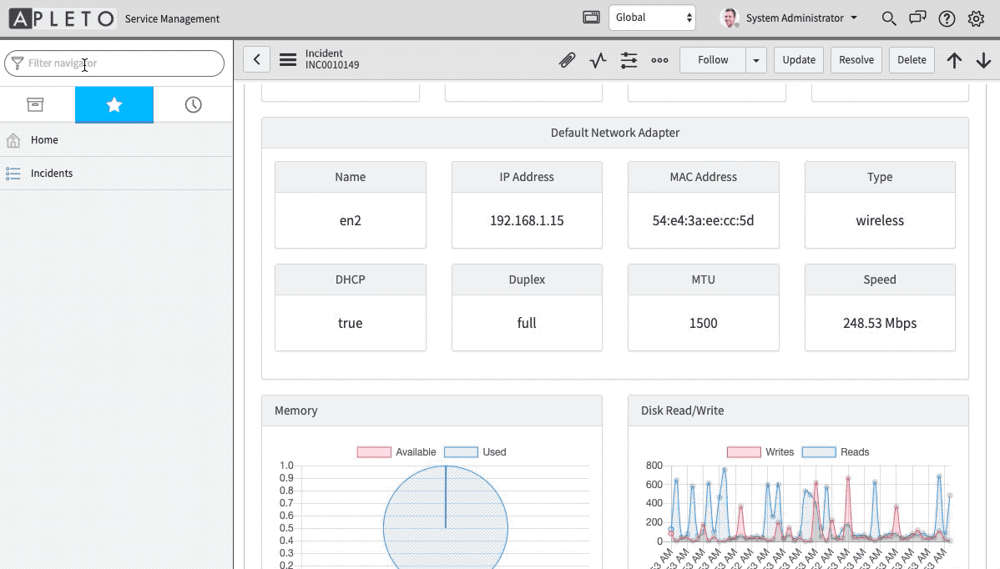
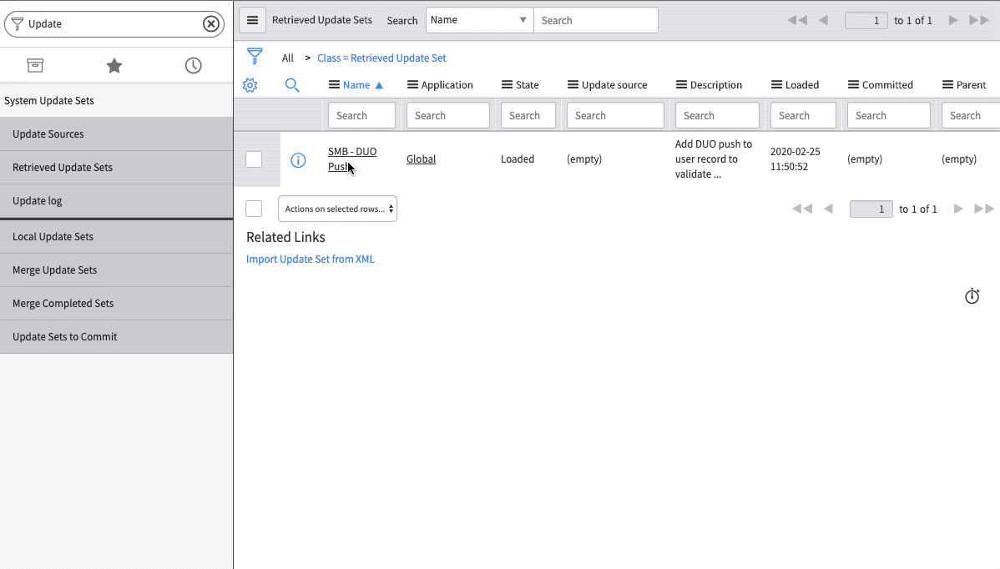
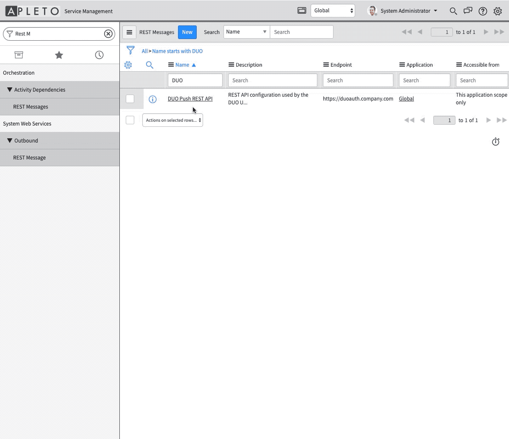
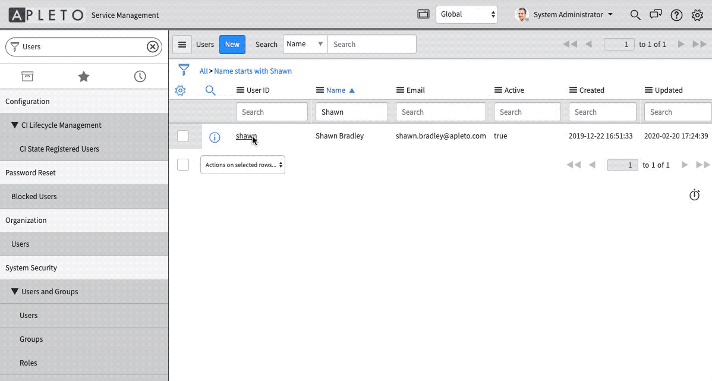

# ServiceNow UI Action for DUO MFA

> ServiceNow (SNOW) UI Action to validate caller identity using DUO mobile multi factor authentication (MFA)

## About Us
Apleto, Inc strives to deliver solutions to simplify information technology support processes for end users and staff with tools like this one and our [JustHelp Agent](https://www.apleto.com/justhelp).


## Quick Start
> The quick start instructions are intended to get you going so you can demonstrate this functionality.  In production you would need to modify the container code to support authentication and run it behind a load balancer or kubernetes ingress to enable https.

### Prerequisites
1.  Access to a ServiceNow instance
2.  Access to the [DUO Auth API](https://duo.com/docs/authapi)
    1.  DUO Auth API Integration Key
    2.  DUO Auth API Secret Key
    3.  DUO Auth API Host
3.  A machine that can be accessed by the MID using http port 3030
    1.  Theoretically this could be the ServiceNow MID Server
    2.  This machine should have Docker installed and be able to run linux containers
4.  A Microsoft SQL Server / Database.  This can be a shared SQL server and is only used to log requests for reporting...
    1.  The user account should have the required permissions to create the table

### Server Configuration

> This could be you MID server, if your MID server can support running Docker.

#### Install Docker on Server (Ubuntu 18.04 LTS)

Update software repos

```bash
sudo apt update
```

Install Docker

```bash
sudo apt install docker.io
```

Start the Docker service

```bash
sudo systemctl start docker
```

Configure Docker to auto start on reboot

```bash
sudo systemctl enable docker
```

#### Build and Run the DUO Auth API container

Clone this repo to the Server

```bash
git clone https://github.com/apleto/ServiceNow-DUO-Push-UI-Action.git

cd ServiceNow-DUO-Push-UI-Action/
```

Update the production config file with SQL server info

```bash
nano config/default.json

## UPDATE LINE 40 and save the file
"mssql": "mssql://<USERNAME>:<PASSWORD>@<MSSQL_SERVER>:1433/<DATABASE>"
```

Build the Docker image

```bash
sudo docker build -t duoauth:1.0.0 .
```

Run the container

```bash
sudo docker run -d -p 3030:3030 -e "IKEY=<DUO AUTHAPI INTERGRATION KEY>" -e "SKEY=<DUO AUTHAPI SECRET KEY" -e "HOST=asdf" duoauth:1.0.0
```

Make sure the container is running

```bash
sudo docker ps

CONTAINER ID        IMAGE                           COMMAND                  CREATED             STATUS              PORTS                              NAMES
07281b608bfb        duoauth  "docker-entrypoint.s…"   2 minutes ago       Up 2 minutes        3000/tcp, 0.0.0.0:3030->3030/tcp   gallant_mcclintock
```

Test the server
> Please not that if everything is working the "username" here will get a DUO push on their device.

```bash
curl -k -d '{"username": "<USERNAME>", "requested_by": "<USERNAME>"}' -H 'Content-Type: application/json' http://localhost:3030/auth

## result
{"result":"allow","status":"allow","status_msg":"Success. Logging you in..."}

```


### ServiceNow Configuration

#### Import duo_push_update_set.xml

1. In ServiceNow go to System Update Sets -> Retrieved Update Sets -> Import XML and import the [duo_push_update_set.xml](duo_push_update_set.xml)


2. Open the SMB - DUO Push update set -> Preview Update Set -> Commit Update Set


#### Configure the REST Method

The REST method configures ServiceNow to talk to the server / container that talks to the DUO Auth API

1.  Go to System Web Services -> REST Message -> DUO Auth
2.  Update the Endpoint - This should be the FQDN or IP for the DUO Auth API container running on your network.
3.  Set the MID server to the MID server running on your network




#### Testing From ServiceNow

From a ServiceNow user form click DUO Push




## Help

If you need help or find an issue please let us know by creating an issue on GitHub [here](https://github.com/apleto/ServiceNow-DUO-Push-UI-Action/issues/new).
